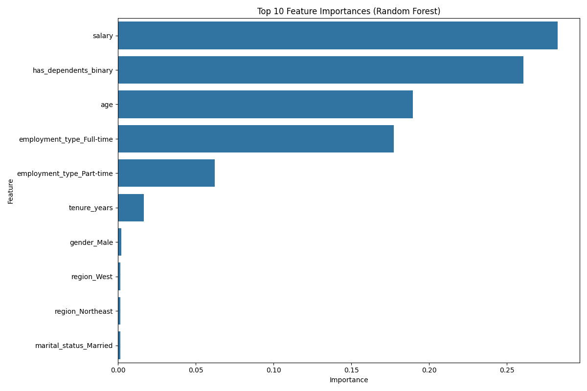
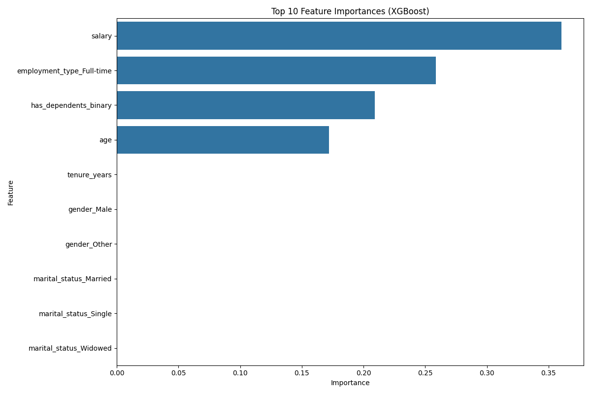

# Employee Insurance Enrollment Prediction Report

## 1. Introduction

This report presents the analysis, methodology, and results of building a machine learning model to predict employee insurance enrollment. The goal was to accurately predict whether an employee will enroll in an insurance plan based on various demographic and employment-related features.

## 2. Data Overview and Analysis

The dataset contains employee information including demographic details, employment information, and insurance enrollment status. Initial analysis revealed:

- No missing values in the dataset
- `employee_id` was identified as a unique identifier that would not contribute to prediction performance
- The target variable `enrolled` is binary (0 or 1)
- Several categorical variables including `gender`, `marital_status`, `employment_type`, and `region`
- Binary variable `has_dependents` with "Yes" or "No" values
- Numerical variables including `age`, `salary`, and `tenure_years`

### Data Distribution

The data was explored using the DataWrangler extension to get a quick overview of the distributions and relationships between features. This helped identify potential patterns and relationships between features and the target variable.

Based on this analysis, we observed no missing values and identified `employee_id` as a non-predictive unique identifier that should be removed from the model input.

## 3. Feature Engineering

Feature engineering decisions were made based on the specific requirements of the prediction task and the nature of each variable:

### Numerical Variables:
- **Age, Salary, and Tenure Years**: StandardScaler was applied to normalize these features (mean=0, standard deviation=1). This scaling approach was chosen because:
  - It helps algorithms that are sensitive to feature magnitudes
  - It's generally preferred for ML algorithms over MinMaxScaler (which might be more suitable for deep learning)
  - It's less affected by outliers than raw values

### Categorical Variables:
- **Gender**: OneHotEncoded since it had multiple categories including "Male", "Female", and "Other"
- **Marital Status, Employment Type, and Region**: OneHotEncoded with `drop='first'` to avoid the dummy variable trap
- **Has Dependents**: Converted from "Yes"/"No" to binary 1/0 values

The reasoning behind these transformations:
- **OneHotEncoding over LabelEncoding**: Used for categorical variables to prevent introducing false ordinal relationships between categories
- **Dropping the first category**: Reduces multicollinearity in the model
- **Separate handling of binary variables**: Simple mapping for binary variables is more interpretable

## 4. Model Development Approach

### Data Splitting Strategy
To ensure proper evaluation and prevent data leakage, the data was split in the following order:
1. Training set (70%)
2. Validation set (20%)
3. Test set (10%)

This splitting strategy allows for:
- Sufficient data for model training
- Independent validation set for hyperparameter tuning
- Truly held-out test set for final evaluation

### Feature Preprocessing
A critical aspect of the implementation was to fit preprocessing transformations only on the training data and then apply them to validation and test sets. This prevents data leakage that would occur if preprocessing was applied to the entire dataset before splitting.

### MLflow Implementation
MLflow was used to track experiments, log parameters, metrics, and models. This enabled systematic comparison of different models and hyperparameter configurations.

### Models Evaluated
Four different classification algorithms were evaluated with extensive hyperparameter tuning:

1. **Logistic Regression**: A baseline linear model
2. **Random Forest**: An ensemble of decision trees
3. **XGBoost**: A gradient boosting algorithm
4. **SVM**: Support Vector Machine classifier

For each model, RandomizedSearchCV was used to explore the hyperparameter space efficiently, with F1 score as the optimization metric.

## 5. Results and Model Selection

### Model Comparison
All models were evaluated on the held-out test set using multiple metrics:

| Model | Accuracy | F1 Score | ROC AUC |
|-------|----------|----------|---------|
| Logistic Regression | 0.896 | 0.916 | 0.970 |
| Random Forest | 1.000 | 1.000 | 1.000 |
| XGBoost | 0.998 | 0.998 | 1.000 |
| SVM | 0.979 | 0.983 | 0.999 |

### Best Model
The **Random Forest** classifier emerged as the best performing model with perfect scores across all metrics on the test set. The optimized hyperparameters for the Random Forest model were:
- n_estimators: 300
- max_depth: 30
- max_features: 'log2'
- min_samples_leaf: 4

This model achieved:
- 100% accuracy on the test set
- 1.0 F1 score
- 1.0 ROC AUC score

The perfect scores suggest the model has successfully captured the patterns in the data. However, it's worth noting that these perfect scores could potentially indicate:
1. Very clear patterns in the data that make the prediction task relatively straightforward
2. Possible data leakage (though our preprocessing pipeline was designed to prevent this)
3. The possibility of overfitting to the specific test set

### Feature Importance
Feature importance analysis from the Random Forest model revealed the most influential features in predicting insurance enrollment. The top features were visualized to understand which factors most strongly influenced enrollment decisions.

**Random Forest:**

**XGBoost:**

Based on the feature importance plot from the Random Forest and XGBoost models, the most significant features were:
- `salary`
- `has_dependents`
- `age`
- `employment_type`

## 6. Conclusion and Recommendations

The machine learning pipeline successfully built a highly accurate model for predicting employee insurance enrollment. The Random Forest classifier outperformed other models, achieving perfect predictive performance on the test set.

### More things I would like to do if I had more time:
## 1. ML Flow side
- Explore additional models such as deep learning approaches
- Investigate the impact of feature interactions
- Conduct a more thorough analysis of feature importance and interactions
- Increasing CV folds to ensure robustness of the model

## 2. API side
- Currently API just returns dict values without json serialization
- Dockerize the API for easier deployment also can deploy on Kubernetes for scalability
- Properly designing the API endpoints with proper status codes and error handling
- Implementing authentication and authorization for the API if publicly accessible else it can be handled by service mesh
- Replacing logging with OpenTelemetry for better observability